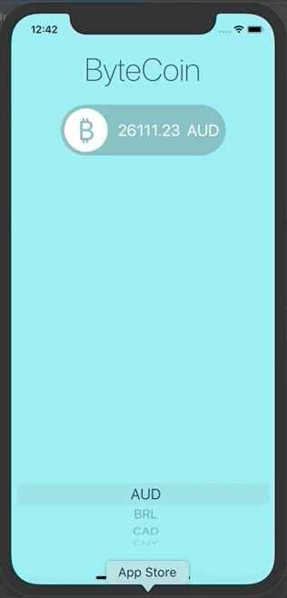

# iOS_13_and_Swift_5
 The Complete iOS App Development Bootcamp taught by Dr. Angela Yu on Udemy

The iOS projects in this repo have been created by Joseph Bae as he follows along the Udemy course.

## 1. I Am Rich 
A simple application showing an ImageView and a Text Label, specifically for iPhone 11 along with app/app store icons for iOS.

## Challenge 1. I Am Poor 
A simple application showing an ImageView and a Text Label, specifically for iPhone 11 along with app/app store icons for iOS.

## 2. Dicee 
A simple application where a user rolls two die for a randomized output.

## Challenge 2. Magic 8 Ball
A simple application where a user shakes the Magic 8 Ball for a randomized fortune.

## 3. Auto Turn Dicee
The Dicee app but with StackViews added in order to account for the phone's orientation

## Challenge 3. Auto Turn Calculator
A Calculator app but with a challenge of figuring out the placement of StackViews in order to have the app's orientation properly work with it's elements.

## 4. Xylophone
A Xylophone application used to showcase Apple libraries for playing sound.

## 5. Egg Timer
An Egg Timer application to make the perfect eggs

## 6. Quizzler
A Quiz application to show and organize questions and answers.

## Challenge 4. Destini
A choose your own adventure game

## 7. BMI Calculator
A BMI Calculator app to learn about classes and optionals in greater depth

## Challenge 5. Tipsy
Tipsy, a meal calculating app that calculates percentages and amount to be split

## 8. Clima
Use APIs to fetch live weather data

## Challenge 6. ByteCoin
Using the Coin API to get the currency exchange rate of a single BitCoin

## 9. FlashChat
A chat based application that uses Firebase

![]FlashChat(FlashChat/FlashChat.gif)

## 10. To Be Announced
To Be Announced

